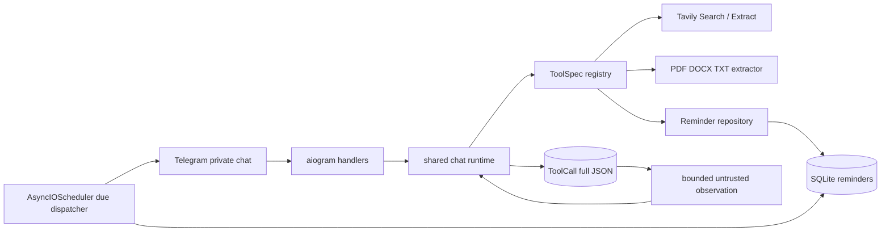

# Sprint 4: Core Toolset qua Telegram

## Quyết định phạm vi

**Giữ đúng phạm vi Sprint 4 trong đề cương; không kéo Sprint 5–7 vào sớm.** Kế hoạch mở rộng runtime `Laplace-Demon/` hiện có, không thay bằng `BaseTool` mới, không port `Laplace-Demon-Beta/`, không tạo API/web UI, không dùng mock hoặc stub để giả thành công.

Plan này nằm ngoài repo public tại `DA1/docs/`; toàn bộ đường dẫn file triển khai bên dưới tính từ `Laplace-Demon/`. Không ghi đường dẫn plan riêng tư này vào README, source code, báo cáo public hoặc commit của dự án.

## Trạng thái và blocker

- Sprint 3 đã hoàn tất theo plan hiện tại, gồm Telegram M-14 và full live evaluator schema v2; Sprint 4 không còn bị chặn bởi Sprint 3.
- Phase 1–4 hoàn tất. Phase 5 được chủ dự án duyệt ngày 2026-10-02 sau khi xác nhận tất cả acceptance gates đã đạt.
- Đã đối chiếu locator DOCX/TXT với fixture gốc; web live, reminder, document, restart và các failure/recovery checks được chủ dự án xác nhận hoàn tất. Báo cáo nghiệm thu public: [Báo cáo Sprint 4](../reports/261002-bao-cao-sprint-04.md). Run-specific raw IDs/timestamps của lượt cuối không được lưu; báo cáo phân loại phần đó là owner-attested.

## Nguồn yêu cầu và lịch

| Nguồn | Contract dùng trong plan |
|---|---|
| `../ĐỀ CƯƠNG ĐỒ ÁN 1_ LAPLACE AI AGENT.docx` | Sprint 4 gồm registry, web research có trích dẫn, document qua Telegram, task/reminder bền qua restart, test lỗi và E2E Telegram. |
| `../Ke hoach cong viec LAPLACE.xlsx` | Ánh xạ S4-01…S4-06, Tavily, PDF/DOCX/TXT ≤10 MiB, APScheduler và video giữa kỳ. Pseudocode chỉ là gợi ý; không ghi đè kiến trúc thật. |
| Code `Laplace-Demon/` | Decorator registry, agent loop tối đa 5 tool executions, SQLite/SQLAlchemy, aiogram long polling, per-user `TurnLease`, full DB result + bounded context. |

Đề cương ghi 21/09–04/10/2026; spreadsheet ghi 28/09–11/10/2026. Plan dùng **21/09–04/10** vì nối trực tiếp Sprint 3 kết thúc 20/09. Nếu lịch môn học xác nhận spreadsheet là lịch mới, dịch toàn bộ mốc một tuần nhưng giữ nguyên scope và gate.

## Outcome phải quan sát được

1. Registry công bố tên, mục đích, lúc nên/không nên dùng, risk metadata, input schema và output schema; runtime validate cả input lẫn output.
2. Telegram có thể tìm web, lấy evidence từ nguồn thật và trả tóm tắt với URL đã xuất hiện trong tool result.
3. Telegram nhận PDF/DOCX/TXT tối đa 10 MiB, trích xuất text theo đơn vị có locator và tóm tắt thông tin quan trọng; PDF scan không có text trả giới hạn thật, không giả OCR.
4. Người dùng private chat tạo, cập nhật, hủy reminder của chính mình; reminder tương lai còn nguyên sau process restart và gửi đúng user.
5. Một kịch bản Telegram thật chạy xuyên tuyến: tìm thông tin → đọc nguồn/tóm tắt → đặt reminder → restart bot → nhận reminder.
6. Mọi lỗi invalid input, thiếu cấu hình, upstream timeout/reject, file hỏng và owner mismatch trả structured failure; agent không mô tả thất bại thành thành công.

## Phases

| Phase | Nội dung | Status | Phụ thuộc | Effort |
|---|---|---|---|---|
| 1 | [Contract registry, execution context và schema](./phase-01-tool-contract-runtime.md) | Completed | Sprint 3 completed | 10h |
| 2 | [Web Search + Extract có citation](./phase-02-web-research.md) | Completed | Phase 1 | 10h |
| 3 | [Document ingestion và bounded extraction](./phase-03-document-processing.md) | Completed | Phase 1 | 14h |
| 4 | [Reminder domain và scheduler phục hồi restart](./phase-04-reminder-scheduler.md) | Completed | Phase 1 | 16h |
| 5 | [Telegram integration, hardening và nghiệm thu](./phase-05-telegram-acceptance.md) | Completed — owner-confirmed 2026-10-02 | Phase 2–4 | 10h |

Phase 2–4 có thể chia owner sau khi Phase 1 khóa contract, nhưng không để hai owner cùng sửa `repo.py`, `chat.py`, `handlers.py`, `config.py` hoặc `pyproject.toml`. Với một người triển khai, chạy tuần tự 1 → 2 → 3 → 4 → 5 là ít rủi ro nhất.

## Kiến trúc chốt

### A. Registry và execution boundary

Giữ `@tool`, `ToolSpec`, `load_builtin_tools()` và một agent loop. Mở rộng contract một lần:

- `ToolSpec`: `name`, `purpose`, `when_to_use`, `when_not_to_use`, `risk_level`, `args_model`, `result_model`, `run`.
- `ToolContext`: identity nội bộ đã resolve, Telegram identity/transport private, conversation/request/task/step IDs và opaque attachment map. Model không được truyền `user_id`, destination hoặc filesystem path.
- `ToolResult`: canonical JSON `{ok,data,error,error_code,retryable,sources,latency_ms}`. `sources` là URL hoặc opaque document locator, không suy ra từ `params.path`.
- Args models `extra="forbid"`; registry trùng tên fail ngay; output được Pydantic validate; executor dùng monotonic clock để ghi latency thật.
- `risk_level` là metadata cho Sprint 5, không phải approval enforcement. Trong
  Sprint 4, reminder chỉ chạy khi private Telegram message chứa directive rõ
  ràng `/remind`, `/remind_update` hoặc `/remind_cancel`, và chỉ tác động
  reminder của chính sender.
- `read_file` model-controlled path bị loại khỏi production registry; sample/test cần file dùng registry riêng. Document access chỉ qua opaque attachment capability, nên `.env`, source tree và upload user khác không thể được address bằng path.

### B. Web research

Dùng REST API chính thức của Tavily qua dependency `httpx` khai báo trực tiếp:

- `web_search`: Tavily `/search`, `include_answer=false`, bounded query/results/chunks.
- `fetch_page`: Tavily `/extract` với một public HTTP(S) URL và query rerank để kết quả bounded. Không fetch URL tùy ý từ máy Laplace, giảm SSRF/local-network surface và bỏ nhu cầu BeautifulSoup.
- Không Tavily SDK, không cache DB trong Sprint 4, không fake result khi thiếu key. `ToolCall` là audit log, không bị dùng sai như cache. Đây là deviation có chủ đích khỏi pseudocode spreadsheet; đề cương ký chỉ yêu cầu search/collect/summary và Sprint 8 mới là tối ưu cache.
- Main agent tổng hợp evidence; không dùng answer do Tavily sinh và không tạo nested LLM call ngoài usage accounting.
- Báo cáo Sprint 4 phải ghi rõ ba deviation: hosted Extract thay local BeautifulSoup fetch, bỏ missing-key stub vì đó là fake success, và defer cache. Nếu supervisor bắt buộc pseudocode spreadsheet, chốt amendment trước khi Phase 2 code; không silently đổi implementation giữa sprint.

### C. Document processing

- Handler private-chat acquire lease, tải/validate rồi gọi shared agent **ngay trong attachment turn**; caption rỗng dùng default summary request. Opaque capability không sống sang turn kế tiếp.
- Chỉ hỗ trợ PDF text layer, DOCX và UTF-8 TXT. Không OCR, image, archive, spreadsheet hay PDF table reconstruction.
- `read_document` chỉ nhận `attachment_id`; path chỉ tồn tại trong trusted `ToolContext` của turn hiện tại.
- Parser untrusted chạy trong subprocess killable với wall-clock/memory cap; PDF/DOCX preflight chặn expanded stream/ZIP vượt budget trước parse.
- Result gồm units có locator và `next_unit`/`complete`. Upload limit 10 MiB tách khỏi `DOCUMENT_FULL_SUMMARY_MAX_CHARS`; tối đa 4 read calls để chừa decision cuối. Vượt full-summary budget chỉ trả partial preview với covered/omitted locators.

### D. Reminder persistence và scheduling

- Một bảng `reminders` owner-linked là source of truth, có `attempt_count` và `next_attempt_at_utc`. Không overload Agent `Task` và không lưu callable pickled trong `SQLAlchemyJobStore`.
- `APScheduler>=3.11,<4` `AsyncIOScheduler` chạy interval dispatcher 1 giây, batch tối đa 25, trên cùng asyncio loop; scheduler job nằm MemoryJobStore và được tạo lại mỗi startup. Reminder rows mới là dữ liệu bền.
- Tool riêng `create_reminder`, `update_reminder`, `cancel_reminder`; owner/destination lấy từ `ToolContext` và `User.telegram_user_id`, không có trong model params.
- State machine: `pending → delivering → sent | failed`; retryable/ambiguous delivery còn trong grace và chưa quá 3 attempts quay lại `pending` với `next_attempt_at`; exhausted ambiguity thành `delivery_unknown`; `pending → cancelled`; quá misfire grace thành `missed`.
- Dispatcher acquire per-user lease **trước** conditional claim, giữ lease qua terminal/requeue commit, và không giữ DB transaction qua Telegram I/O. Delivery dùng at-least-once semantics: message chứa stable reminder ID; crash sau Telegram accept có thể gây duplicate, nhưng không được mất silently hoặc giả `sent`.
- Healthy/unloaded SLA cho một reminder: claim bắt đầu không muộn hơn `due_at + 2s`; Telegram success không muộn hơn `due_at + 12s` với send timeout 10s. Late/retry notifications ghi scheduled time và late marker.
- `/forget` pre-confirm và success text phải nói rõ pending/historical reminders
  bị xóa, usage được giữ, còn file upload tạm đã bị xóa sau document turn và
  không thuộc memory; same lease ngăn delete commit rồi notification vẫn gửi.

## Scope exclusions

- Không Approval Gate/UI approve-reject hoặc policy enforcement của Sprint 5.
- Không verifier, retry framework tổng quát, task crash recovery hoặc evaluator của Sprint 6–7.
- Không RAG/vector DB/OCR/browser automation/calendar/recurring reminders/FastAPI/web UI/arbitrary shell.
- Không direct arbitrary URL fetch từ máy local; không plugin marketplace/package auto-discovery.
- Không hứa exactly-once delivery giữa SQLite và Telegram; không hứa full-document summary cho mọi file 10 MiB.

## Traceability S4-01…S4-06

| Roadmap ID | Phase | Bằng chứng cuối |
|---|---|---|
| S4-01 Registry metadata | 1 | Tool specs có input/output/risk/usage contract; duplicate và invalid return bị chặn. |
| S4-02 Web research | 2 | Search + extract thật, URL sources canonical, missing key/upstream error không fake. |
| S4-03 Tool tests | 1–4 | Success, invalid input và external failure ở boundary có observable assertions. |
| S4-04 Document tool | 3 + 5 | PDF/DOCX/TXT qua Telegram, locator citation, ownership và limit. |
| S4-05 Reminder tool | 4 + 5 | CRUD owner-safe, persisted UTC, startup recovery, due notification. |
| S4-06 Telegram E2E | 5 | Live multi-step run + restart + sanitized evidence/video checklist. |

## Definition of Done

- [x] Sprint 3 blocker được đóng; branch `sprint04` tách từ baseline đã nghiệm thu.
- [x] Production registry chỉ chứa tools an toàn theo capability; `read_file` path-based đã retire khỏi production. Mọi tool còn lại dùng contract mới; không callable signature cũ, source path-only hoặc Python `str(dict)` payload.
- [x] Web Search + Extract live trả evidence thật; final URLs đều có trong stored tool sources.
- [x] PDF/DOCX/TXT live qua Telegram cho summary có locator; unsupported/scanned/corrupt/oversize bị từ chối trung thực.
- [x] Reminder create/update/cancel owner-safe; restart trước due, restart trong grace sau due và crash-after-claim recovery đều đúng persistent retry contract; measured timing đạt SLA đã nêu trong healthy single-reminder case.
- [x] `/forget` không race với reminder delivery, xóa reminders của đúng user, không đổi usage và nói rõ upload tạm đã bị xóa sau document turn, không thuộc memory.
- [x] Automated focused tests chạy offline không network; smoke chạy shared runtime thật với DB/file/fake adapter; live acceptance dùng Telegram + Tavily thật.
- [x] Cuối integration chạy `.venv/bin/python -m pytest` và `.venv/bin/ruff check .` đúng một lần sau focused checks.
- [x] README, `.env.example`, hướng dẫn vận hành và báo cáo giữa kỳ public phản ánh đúng behavior đã quan sát, không chứa secret/path riêng/raw tài liệu người dùng. README và `.env.example` mô tả Sprint 4; báo cáo public nằm tại [Báo cáo Sprint 4](../reports/261002-bao-cao-sprint-04.md).

## Rủi ro chấp nhận có chủ đích

| Mức | Rủi ro | Control trong Sprint 4 | Phần để sprint sau |
|---|---|---|---|
| P0 | Model giả owner/destination hoặc dùng document path | Trusted `ToolContext`, extra-forbid args, opaque attachment ID, owner-filtered SQL | Approval/risk policy Sprint 5 |
| P0 | Duplicate hoặc mất reminder tại crash window | Persistent attempts, startup requeue trong grace, stable reminder ID, at-least-once acceptance và explicit duplicate risk | Exactly-once không thể có nếu Telegram không hỗ trợ idempotency |
| P0 | File nén/parser làm phình RAM hoặc treo worker | 10 MiB actual cap, expanded-stream/ZIP preflight, killable subprocess, wall-clock/memory limit | OCR/malware sandbox đầy đủ không thuộc scope |
| P0 | Tool data vượt context hoặc prompt-inject | Existing untrusted envelope, source-first bounded observation, paged document units | Verifier/adversarial suite sâu hơn Sprint 6–7 |
| P1 | Tavily quota/key/upstream lỗi | Explicit configuration/upstream errors, bounded timeout, offline fake adapter + one live gate | Retry/backoff tổng quát để Sprint 6 |
| P1 | Date mơ hồ/timezone/DST | Trusted current time + configured IANA zone, offset validation, store UTC epoch | Per-user timezone/recurrence không thuộc scope |
| P1 | Multi-process duplicate scan | Một bot process, conditional DB claim, documented deployment invariant | Distributed scheduler ngoài v1 |

## External references đã đối chiếu

- Tavily Search: <https://docs.tavily.com/documentation/api-reference/endpoint/search>
- Tavily Extract: <https://docs.tavily.com/documentation/api-reference/endpoint/extract>
- APScheduler 3.x guide: <https://apscheduler.readthedocs.io/en/3.x/userguide.html>
- AsyncIOScheduler: <https://apscheduler.readthedocs.io/en/3.x/modules/schedulers/asyncio.html>
- pypdf text extraction limits: <https://pypdf.readthedocs.io/en/latest/user/extract-text.html>
- python-docx text model: <https://python-docx.readthedocs.io/en/latest/user/text.html>
- aiogram Dispatcher lifecycle: <https://docs.aiogram.dev/en/latest/dispatcher/dispatcher.html>

## Handoff

Sau khi Sprint 3 completed, chạy:

`/ck:cook /Users/thanhnguyen/Documents/DA1/docs/260912-2011-sprint4-core-tools/plan.md`
