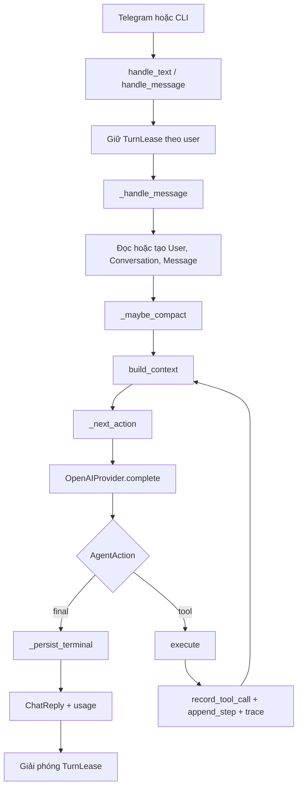

# Báo cáo các hàm và nguyên lý hoạt động Laplace Demon

## 1. Phạm vi

Tài liệu này giải thích mã nguồn ứng dụng trong `Laplace-Demon/laplace/`, không phân tích test, script benchmark hay artifact thực nghiệm. Snapshot hiện tại có **123 hàm/phương thức trong 22 file Python**:

- **23 hàm chính**: giải thích chi tiết mục đích, luồng xử lý, dữ liệu vào/ra, bất biến và lỗi.
- **100 hàm hỗ trợ**: mỗi hàm được mô tả một dòng ở phần phụ lục.
- Số dòng chỉ dùng để tra cứu theo snapshot ngày 16/09/2026; khi mã nguồn thay đổi, nên tìm theo tên hàm thay vì phụ thuộc số dòng.

## 2. Nguyên lý tổng thể

### 2.1 Các nguyên tắc thiết kế

1. **Một runtime dùng chung:** CLI, Telegram và evaluator đều đi qua `_handle_message`; không có ba vòng agent khác nhau.
2. **Context hữu hạn:** dữ liệu gửi model bị giới hạn theo nhóm hội thoại; không cắt rời cặp action/observation.
3. **DB đầy đủ, prompt hữu hạn:** kết quả tool đầy đủ nằm trong SQLite, model chỉ nhận excerpt có giới hạn.
4. **Dữ liệu không tin cậy không được nâng quyền:** session memory và tool output được gắn nhãn `UNTRUSTED_*`, không trở thành system instruction.
5. **Structured action:** model phải trả `AgentAction` dạng JSON; dữ liệu sai schema được yêu cầu sửa tối đa hai lần.
6. **Transaction ngắn:** không giữ transaction DB trong thời gian gọi mạng hoặc chạy tool.
7. **Một worker mỗi user:** `TurnLease` ngăn hai lượt chat hoặc thao tác xóa memory cùng user chạy đồng thời.
8. **Hủy hợp tác:** `/cancel` đặt cờ; worker dừng tại checkpoint an toàn, không cưỡng bức ngắt HTTP/thread.
9. **Memory có nguồn:** summary giữ ID message/tool; summary do model đề xuất không được viện dẫn ID ngoài tập nguồn cho phép.
10. **Terminal rõ ràng:** mỗi lượt kết thúc bằng một trạng thái `final`, `cancelled`, `schema_failure`, `context_overflow`, `step_limit` hoặc `execution_error`.

## 3. Các hàm chính

### 3.1 `prompts.system_message()`

**Vai trò:** tạo system message cố định cho mọi lần gọi agent.

**Cách hoạt động:**

1. Lấy `SYSTEM_PROMPT`, trong đó quy định model chỉ được trả một JSON object dạng `tool` hoặc `final`.
2. Gọi `_tools_block()` để serialize toàn bộ tool hiện có từ registry.
3. Ghép chính sách và danh sách tool thành `{"role": "system", "content": ...}`.

**Bất biến:** raw user text, session memory và tool output không được ghép vào system prompt. Chúng luôn nằm ở message dữ liệu riêng và được đánh dấu không tin cậy.

**Đầu ra:** một message chuẩn OpenAI Chat Completions.

---

### 3.2 `llm.base.get_provider(name=None)`

**Vai trò:** factory chọn implementation LLM dựa trên cấu hình.

**Cách hoạt động:**

1. Đọc tên provider từ tham số hoặc `Settings().llm_provider`.
2. Nếu tên không nằm trong `PRESETS`, trả `MockLLM` để chạy offline.
3. Với provider thật, gọi `resolve_provider_config()` để lấy preset, API key và model override.
4. Thiếu key thì ném `MissingAPIKeyError` kèm đúng tên biến môi trường và URL lấy key.
5. Có key thì tạo `OpenAIProvider` với `base_url`, model và bảng giá của preset.

**Ý nghĩa kiến trúc:** Gemini, OpenAI, Groq, B.AI và 9Router dùng chung adapter; việc đổi provider không làm thay đổi chat runtime.

---

### 3.3 `llm.openai_provider.OpenAIProvider.complete()`

**Vai trò:** ranh giới mạng giữa ứng dụng và API tương thích OpenAI Chat Completions.

**Đầu vào:** danh sách messages và tùy chọn JSON Schema.

**Cách hoạt động:**

1. Copy danh sách message để không sửa input của caller.
2. Nếu có schema, thêm instruction yêu cầu JSON và thử `response_format={"type":"json_object"}`.
3. Gọi `chat.completions.create()`.
4. Nếu backend từ chối `response_format`, bỏ tham số này và thử lại bằng instruction trong prompt.
5. Nếu gặp rate limit 429, chờ theo hint `retry in ...s` hoặc backoff tăng dần, tối đa năm lần retry.
6. Parse content thành dict khi caller yêu cầu schema; parse lỗi thì giữ raw content và trả `parsed=None`.
7. Chuẩn hóa model, token, latency, finish reason và chi phí thành `LLMResult`.

**Không làm:** hàm không validate dữ liệu theo Pydantic `AgentAction`; `_next_action()` chịu trách nhiệm đó.

**Rủi ro được kiểm soát:** backend OpenAI-compatible không đồng nhất về `response_format`; model không có bảng giá được cảnh báo và tạm tính `0.0`.

---

### 3.4 `context.build_context()`

**Vai trò:** dựng context ba lớp cho một lần gọi model và bảo đảm ngân sách ký tự.

**Các lớp dữ liệu:**

1. System policy và tool schemas.
2. Session state gồm task card và rolling summary.
3. History gần đây, request hiện tại và execution groups của lượt đang chạy.

**Thuật toán cắt:**

1. Ghép toàn bộ message theo đúng thứ tự.
2. Nếu vượt `max_chars`, bỏ history group cũ nhất; mỗi group là một exchange nguyên vẹn.
3. Nếu vẫn vượt, bỏ execution group cũ nhưng luôn giữ execution group mới nhất.
4. Nếu vẫn vượt, bỏ rolling summary trước; task card được ưu tiên giữ.
5. Nếu phần bắt buộc vẫn quá lớn, trả `overflow_reason="required_context_too_large"` thay vì âm thầm gửi request vượt ngân sách.

**Đầu ra:** `ContextBuild` gồm messages, tổng ký tự, số group bị bỏ và nguyên nhân overflow.

**Bất biến:** request hiện tại, system policy và causal unit mới nhất không bị cắt rời.

---

### 3.5 `context.bounded_tool_observation()`

**Vai trò:** chuyển kết quả tool thành observation an toàn và hữu hạn cho model.

**Cách hoạt động:**

1. Tạo JSON metadata gồm tên tool, trạng thái, source, `tool_call_id`, độ dài payload và excerpt.
2. Bọc JSON bằng nhãn `UNTRUSTED_TOOL_DATA_JSON`.
3. Nếu quá 1.200 ký tự, dùng binary search tìm kích thước excerpt lớn nhất vẫn vừa giới hạn.
4. `_bounded_text()` giữ phần đầu và cuối, đồng thời ghi số ký tự đã lược.
5. Nếu riêng metadata đã vượt giới hạn, ném `ValueError` thay vì tạo observation sai contract.

**Lưu ý:** `tool_call_id` chỉ để truy vết DB; nó không cho model quyền tự đọc lại payload đầy đủ.

---

### 3.6 `context.fit_summary()`

**Vai trò:** chuẩn hóa rolling summary vào giới hạn 2.000 ký tự.

**Cách hoạt động:**

1. Deduplicate theo loại fact, text và tập source IDs; bản mới nhất thắng.
2. Giới hạn tối đa hai entry trên cùng source để một nguồn không chiếm toàn bộ summary.
3. Ưu tiên decision/user fact có nguồn, sau đó reason/result/source, cuối cùng entry yếu hơn.
4. Giữ tối đa 10 entries.
5. Nếu JSON vẫn quá dài, bỏ entry ưu tiên thấp nhất và tăng `omitted_count` đến khi vừa.

**Đầu ra:** JSON string đúng schema `SummaryDocument`.

**Trade-off:** đây là memory hữu hạn, không cam kết giữ mọi fact; E-05 trong benchmark cho thấy fact giữa payload có thể bị mất.

---

### 3.7 `context.extractive_summary()`

**Vai trò:** fallback deterministic khi provider là mock, model lỗi hoặc summary model không hợp lệ.

**Cách hoạt động:**

1. Parse summary trước đó; summary hỏng được coi là rỗng.
2. Duyệt message và giữ nội dung có tín hiệu như quyết định, cập nhật, lý do, nguồn hoặc user fact.
3. Bỏ user message rất dài không có marker quan trọng và các assistant acknowledgement vô nghĩa.
4. Gắn mỗi entry với `source_message_ids`.
5. Đưa source và payload excerpt của tool thành entry có `source_tool_call_ids`.
6. Deduplicate rồi gọi `fit_summary()`.

**Bất biến:** không sinh fact mới; mọi entry đều truy được về message hoặc tool call.

---

### 3.8 `services.chat._maybe_compact()`

**Vai trò:** compact history cũ trước khi dựng context Sprint 3.

**Cách hoạt động:**

1. Kiểm tra phần context bắt buộc có tự vượt ngân sách hay không; nếu có thì không compact vô ích.
2. Tính tổng ký tự chưa nằm sau watermark bằng SQL, không tải toàn bộ nội dung vào RAM.
3. Nếu summary + history vẫn vừa ngân sách, kết thúc.
4. Bảo vệ tối đa bốn exchange gần nhất; nếu chúng quá lớn thì giảm số exchange được giữ.
5. Lấy một page cũ nhất, bounded, tối đa tám message và chỉ chốt ở assistant terminal.
6. Tạo extractive fallback trước.
7. Với provider thật, yêu cầu model sinh `SummaryDocument`; usage của call compact được ghi trước khi watermark tiến.
8. Chỉ chấp nhận summary model nếu mọi source ID thuộc tập nguồn của fallback và mỗi entry có nguồn.
9. Cập nhật summary + watermark bằng compare-and-update nguyên tử.
10. Lặp tối đa hai page mỗi turn; phần còn lại được ghi trace `compaction_backlog`.

**Bất biến:** không giữ transaction trong lúc gọi model; không tiến watermark nếu usage persistence hoặc update summary thất bại.

---

### 3.9 `services.chat._next_action()`

**Vai trò:** lấy một hành động hợp lệ từ model.

**Cách hoạt động:**

1. Sinh JSON Schema từ `AgentAction`.
2. Dựng lại context ở mỗi attempt; retry vẫn chịu cùng ngân sách.
3. Gọi provider và ghi usage với purpose `agent_action` hoặc `schema_retry`.
4. Validate `result.parsed` bằng Pydantic.
5. Nếu sai, thêm `retry_group` gồm raw reply hữu hạn và lỗi validation rồi gọi lại.
6. Sau tối đa hai retry, trả `(None, "schema_failure")`.
7. Nếu context bắt buộc quá lớn, trả nguyên nhân overflow mà không gọi provider.

**Đầu ra:** một `AgentAction` đã validate hoặc stop reason cụ thể.

---

### 3.10 `services.chat._handle_message()`

**Vai trò:** runtime trung tâm của toàn bộ sản phẩm.

**Luồng chính:**

1. Nạp built-in tools, Settings và recorder usage.
2. Transaction ngắn đầu tiên tạo/lấy user, conversation và ghi request message.
3. Với strategy `sprint3`, gọi `_maybe_compact()`.
4. Đọc history theo strategy:
   - `full`: toàn bộ lịch sử trước request;
   - `window10`: tối đa chín message cũ cộng request hiện tại;
   - `sprint3`: recent tail sau watermark, task card và rolling summary.
5. Chạy vòng quyết định tối đa năm tool steps.
6. Trước và sau mỗi model/tool step, kiểm tra cờ cancel.
7. Gọi `_next_action()`:
   - `final`: ghi terminal và trả `ChatReply`;
   - `tool`: tạo task nếu đây là tool đầu tiên, chạy tool, ghi full payload, step, trace và task card, rồi lặp;
   - lỗi schema/overflow: ghi terminal failed;
   - quá bước: ghi `step_limit`.
8. Nếu exception ngoài dự kiến xảy ra sau khi đã có task, cố ghi `execution_error` rồi ném lỗi lại.

**Bất biến:** task chỉ được tạo khi thật sự có tool; mọi terminal assistant answer được lưu; tool output đầy đủ ở DB nhưng prompt Sprint 3 chỉ nhận bounded observation.

---

### 3.11 `services.chat._persist_terminal()`

**Vai trò:** đóng một lượt chat trong một transaction ngắn.

**Cách hoạt động:** nếu có task thì ghi terminal step và chuyển task khỏi `running`; luôn ghi trace terminal và assistant message; sau đó dựng task card cuối.

**Bất biến:** `close_task()` chỉ cập nhật task còn `running`, nên terminal đầu tiên thắng. Nếu transaction lỗi, toàn bộ terminal persistence rollback cùng nhau.

---

### 3.12 `services.chat._run_reserved_message()`

**Vai trò:** adapter giữa lease concurrency và runtime chat.

**Cách hoạt động:** kiểm lease thuộc đúng user và chưa release, gọi `_handle_message()`, rồi luôn `release_turn()` trong `finally` kể cả khi runtime lỗi.

**Ý nghĩa:** reservation không bị kẹt sau exception.

---

### 3.13 `services.chat.handle_message()`

**Vai trò:** public API đồng bộ cho CLI/service caller.

**Cách hoạt động:** thử reserve user; nếu user đang có worker thì trả lời busy ngay, nếu thành công thì chuyển vào `_run_reserved_message()`.

**Đầu ra:** `ChatReply` gồm text và tổng usage của lượt.

---

### 3.14 `services.memory.try_reserve_turn()`

**Vai trò:** cấp quyền độc quyền process-local cho một user.

**Cách hoạt động:** giữ lock, kiểm `_active`, tạo `TurnLease` nếu chưa có owner và trả `None` nếu đang bận.

**Giới hạn:** chỉ bảo vệ trong một process; không phải distributed lock cho nhiều bot instance.

---

### 3.15 `services.memory.request_cancel()`

**Vai trò:** triển khai cooperative cancellation.

**Cách hoạt động:** tìm lease đang hoạt động; chỉ lease loại `chat` mới được đặt `cancel_event`. Hàm không kill thread và không hủy HTTP đang chạy.

**Hệ quả:** usage/kết quả của call đang chạy vẫn có cơ hội được ghi, sau đó worker dừng ở checkpoint kế tiếp.

---

### 3.16 `services.memory.forget_memory()`

**Vai trò:** xóa memory của một user mà không đua với worker chat.

**Cách hoạt động:**

1. Reserve user bằng lease loại `forget`; đang bận thì trả `busy`.
2. Mở transaction và tìm user; không có thì trả `empty`.
3. Chụp usage trước khi xóa.
4. Gọi `repo.wipe_session()`.
5. Tính usage sau xóa; khác trước thì ném lỗi để rollback.
6. Trả `deleted` cùng thống kê; luôn release lease trong `finally`.

**Bất biến:** memory bị xóa nhưng accounting LLM được giữ nguyên.

---

### 3.17 `db.session_scope()`

**Vai trò:** quản lý transaction/session SQLAlchemy thống nhất.

**Cách hoạt động:** tạo session, yield cho caller, commit khi thành công, rollback và re-raise khi lỗi, cuối cùng luôn close.

**Nguyên tắc sử dụng:** repository helper không tự commit; transaction boundary nằm ở service thông qua `session_scope()`.

---

### 3.18 `repo.update_conversation_summary()`

**Vai trò:** cập nhật rolling summary và watermark nguyên tử, có kiểm tra cạnh tranh.

**Cách hoạt động:** chạy một câu `UPDATE` với điều kiện watermark hiện tại phải bằng `old_watermark`; đồng thời set summary và `new_watermark`.

**Đầu ra:** `True` nếu đúng một row được cập nhật, `False` nếu state đã thay đổi bởi luồng khác.

**Bất biến:** summary mới không thể đi cùng watermark cũ hoặc ngược lại.

---

### 3.19 `repo.session_stats()`

**Vai trò:** tạo snapshot memory hữu hạn cho lệnh `/memory`.

**Cách hoạt động:** đếm conversation/message/task/tool call, lấy summary, bốn message gần nhất, ba task gần nhất và tối đa hai tool preview mỗi task; cuối cùng gắn usage theo user.

**Bảo vệ kích thước:** goal, source, result và recent message đều bị giới hạn trước khi trả ra Telegram.

---

### 3.20 `repo.wipe_session()`

**Vai trò:** xóa dữ liệu phiên theo ownership mà vẫn giữ user và usage.

**Cách hoạt động:**

1. Thu thập conversation IDs và task IDs của user.
2. Tách `LLMCall` khỏi task trước khi xóa và gắn trực tiếp `user_id` để giữ accounting.
3. Xóa `Step` và `ToolCall` theo task.
4. Kiểm tra Trace có task/conversation ownership chéo; nếu có thì từ chối toàn bộ thao tác.
5. Xóa Trace, Task, Message và Conversation theo thứ tự child-first.
6. Không xóa tool log legacy có `task_id=NULL`; chỉ báo số lượng orphan.

**Bất biến:** dữ liệu user khác không bị xóa; xung đột ownership làm transaction rollback.

---

### 3.21 `tools.base.execute()`

**Vai trò:** boundary thực thi tool thống nhất.

**Cách hoạt động:** tìm tool trong registry, validate params bằng Pydantic, gọi callable và bắt exception. Mọi nhánh đều trả `ToolResult`; lỗi tool không được làm vỡ agent loop.

**Lợi ích:** model nhận lỗi có cấu trúc để tự sửa tên tool hoặc tham số ở bước sau.

---

### 3.22 `tools.read_file.read_file()`

**Vai trò:** built-in tool đọc file văn bản an toàn trong working directory.

**Cách hoạt động:** resolve đường dẫn từ `cwd`, từ chối path thoát ra ngoài root, yêu cầu target là file, đọc tối đa 64 KiB và chỉ chấp nhận UTF-8.

**Lỗi:** file thiếu, path traversal hoặc binary/non-UTF-8 trở thành `ValueError`; `execute()` chuyển lỗi này thành `ToolResult(ok=False)`.

---

### 3.23 `bot.handlers.handle_text()`

**Vai trò:** nối Telegram async với runtime chat đồng bộ.

**Cách hoạt động:**

1. Chuẩn hóa text và từ chối command không hỗ trợ.
2. Reserve user trước await quan trọng đầu tiên.
3. Gửi typing/status message.
4. Chạy `_run_reserved_message()` trong worker thread bằng `asyncio.to_thread()`.
5. `_StatusEditor` chuyển progress callback từ worker thread về event loop và gộp các update dồn dập.
6. `asyncio.shield()` bảo đảm việc handler ngừng chờ không tự hủy worker thật.
7. Khi xong, cắt câu trả lời theo giới hạn Telegram và gửi lần lượt.
8. Nếu worker chưa kịp start, handler tự release lease; nếu đã start, worker là owner release.

**Bất biến:** không có khe thời gian để request thứ hai cùng user chen vào giữa reserve và start worker.

## 4. Luồng dữ liệu quan trọng

### 4.1 Một lượt chat không dùng tool

`handle_text` → reserve lease → `_handle_message` ghi user message → build context → `_next_action` → model trả `final` → `_persist_terminal` ghi assistant message/trace → trả `ChatReply` → release lease.

### 4.2 Một lượt chat dùng tool

Model trả `tool` → runtime tạo Task → `execute` validate và chạy tool → lưu full payload vào `ToolCall` → tạo bounded observation → ghi Step/Trace/task card → build context mới → model quyết định tool tiếp hoặc final.

### 4.3 Compaction session memory

History vượt budget → chọn page cũ hoàn chỉnh → tạo extractive fallback có source IDs → model có thể đề xuất summary tốt hơn → validate nguồn → ghi usage → compare-and-update summary/watermark → recent tail tiếp tục được giữ nguyên.

### 4.4 Xóa memory

`/forget confirm` → reserve lease loại `forget` → chụp usage → xóa child-first theo ownership → xác nhận usage không đổi → commit → release lease.

## 5. Phụ lục: các hàm hỗ trợ, mỗi hàm một dòng

### 5.1 `repo.py`

| Hàm | Giải thích một dòng |
|---|---|
| `find_user` | Tìm user theo Telegram ID nhưng không tạo dữ liệu mới. |
| `get_or_create_user` | Lấy hoặc tạo user, đồng thời cập nhật username mới nhất. |
| `get_or_create_conversation` | Lấy conversation mới nhất của user hoặc tạo conversation đầu tiên. |
| `add_message` | Thêm message, flush và trả row để caller dùng ID ngay. |
| `recent_messages` | Lấy tối đa N message mới nhất rồi đảo về thứ tự thời gian tăng dần. |
| `conversation_messages` | Đọc history theo conversation và khoảng ID. |
| `conversation_message_char_count` | Đếm ký tự bằng SQL mà không materialize content. |
| `_bounded_db_excerpt` | Ghép prefix/suffix DB thành excerpt head/tail hữu hạn. |
| `conversation_message_page` | Đọc page cũ nhất với projection content có giới hạn. |
| `recent_conversation_messages` | Đọc recent tail theo thứ tự thời gian. |
| `create_task` | Tạo task trạng thái `running` ngay trước tool đầu tiên. |
| `append_step` | Lưu snapshot decision/observation version 1 của task. |
| `close_task` | Chỉ đóng task còn `running`, để terminal đầu tiên thắng. |
| `task_snapshot` | Tổng hợp goal, trạng thái, tool count, criteria và remaining work cho task card. |
| `tool_rows_for_request_ids` | Đọc bounded tool projections gắn với các request message IDs. |
| `record_llm_call` | Ghi provider/model/token/cost/latency và ownership của một LLM call. |
| `record_tool_call` | Ghi full params/result của tool và liên kết task. |
| `record_trace` | Ghi trace JSON theo task/conversation và step index. |
| `user_usage` | Tổng hợp usage trực tiếp hoặc qua task mà không đếm đôi. |

### 5.2 `context.py`

| Hàm | Giải thích một dòng |
|---|---|
| `message_chars` | Cộng độ dài content của toàn bộ messages. |
| `_copy_group` | Copy message dict trong một group để caller không mutate dữ liệu gốc. |
| `group_history` | Nhóm history thành exchange nguyên vẹn và gắn nhãn request chưa có assistant terminal. |
| `_bounded_text` | Giữ head/tail của text và chèn marker số ký tự bị lược. |
| `_session_state` | Đóng task card và summary thành một user message dữ liệu không tin cậy. |
| `retry_group` | Tạo cặp assistant reply sai và user correction prompt có giới hạn. |
| `render_task_card` | Render goal, criteria, step, tools, remaining và status trong tối đa 1.000 ký tự. |
| `parse_summary` | Parse summary JSON; dữ liệu rỗng/hỏng trở thành document rỗng. |

### 5.3 `prompts.py`

| Hàm | Giải thích một dòng |
|---|---|
| `TaskUpdate._validate_items` | Bắt mỗi mục criteria/remaining có độ dài 1–200 ký tự. |
| `AgentAction._check_fields_by_action` | Bắt action `tool` có tên tool và action `final` có câu trả lời. |
| `_tools_block` | Serialize registry tool thành phần `AVAILABLE TOOLS`. |

### 5.4 `db.py`

| Hàm | Giải thích một dòng |
|---|---|
| `_enable_sqlite_foreign_keys` | Bật `PRAGMA foreign_keys=ON` cho từng SQLite connection. |
| `_create_engine` | Tạo SQLAlchemy engine; SQLite memory dùng `StaticPool`. |
| `get_engine` | Lazy-create và trả engine/session factory singleton. |
| `_migrate_sprint3` | Thêm các cột Sprint 3 còn thiếu theo migration additive idempotent. |
| `init_db` | Chạy `create_all` rồi migration Sprint 3. |
| `reset_engine_for_tests` | Dispose engine hiện tại và thay bằng test engine hoặc reset về chưa khởi tạo. |

### 5.5 `models.py`, `tasks.py`, `agent.py`, `__main__.py`

| Hàm | Giải thích một dòng |
|---|---|
| `models.utcnow` | Trả thời điểm UTC cho các cột timestamp. |
| `tasks.successful_sample` | Tạo sample task có ba bước đều thành công. |
| `tasks.failed_sample` | Tạo sample task dừng ở bước kiểm tra lỗi. |
| `__main__.main` | Parse CLI và dispatch sang bot, chat, sample agent hoặc readiness output. |
| `TaskStep.__post_init__` | Validate tên bước và tính nhất quán giữa success/failure reason. |
| `AgentTask.__post_init__` | Validate tên task và mọi phần tử phải là `TaskStep`. |
| `AgentResult.__post_init__` | Validate status, counts và completion reason của kết quả sample agent. |
| `Agent.__init__` | Validate giới hạn bước không âm. |
| `Agent.run` | Chạy sample steps tuần tự đến completed, failed hoặc step limit. |

### 5.6 `llm/presets.py`, `llm/base.py`, `llm/mock.py`, `llm/openai_provider.py`

| Hàm | Giải thích một dòng |
|---|---|
| `ProviderPreset.env_key` | Suy ra tên biến môi trường API key từ tên provider. |
| `ProviderPreset.settings_field` | Suy ra field tương ứng trong `Settings`. |
| `mask_key` | Che key khi hiển thị, chỉ giữ prefix ngắn. |
| `missing_key_message` | Tạo lỗi thiếu key kèm biến môi trường và URL lấy key. |
| `LLMProvider.complete` | Khai báo protocol chuẩn cho mọi provider. |
| `resolve_provider_config` | Resolve preset, key và model theo Settings. |
| `MockLLM.__init__` | Copy script và tạo call log độc lập cho test. |
| `MockLLM.complete` | Trả response scripted/heuristic deterministic, không gọi mạng. |
| `_retry_delay_from` | Parse thời gian retry từ lỗi hoặc tính backoff, cap 90 giây. |
| `_compute_cost` | Tính chi phí theo token và bảng giá USD/1M token. |
| `OpenAIProvider.__init__` | Tạo OpenAI SDK client với base URL/model/pricing, chưa gọi mạng. |

### 5.7 `services/chat.py`

| Hàm | Giải thích một dòng |
|---|---|
| `_TurnRecorder.__init__` | Khởi tạo bộ đếm calls, prompt/completion tokens và cost cho một turn. |
| `_TurnRecorder.add` | Cộng usage của một `LLMResult` vào turn. |
| `_TurnRecorder.summary` | Trả usage tổng hợp, gồm total tokens và cost làm tròn. |
| `_plain_messages` | Chuyển ORM row/dict thành messages chỉ gồm role user/assistant. |
| `_record_llm_result` | Cộng turn usage và persist một `LLMCall` trong transaction riêng. |
| `_summary_source_ids` | Thu tập message/tool source IDs của summary document. |
| `_message_exchanges` | Nhóm persisted rows thành exchange mà không copy payload lớn. |
| `_build_for_call` | Gọi `build_context` với policy tương ứng `full`, `window10` hoặc `sprint3`. |
| `_task_state` | Trích criteria và remaining work từ `AgentAction.task_update`. |
| `_full_observation` | Tạo observation chứa full payload cho hai baseline không bounded. |

### 5.8 `services/memory.py`

| Hàm | Giải thích một dòng |
|---|---|
| `release_turn` | Chỉ owner lease hiện tại được xóa reservation; gọi lặp lại an toàn. |
| `user_busy` | Kiểm user có lease đang sống trong process hay không. |
| `load_memory` | Đọc snapshot memory committed và gắn trạng thái busy. |

### 5.9 `bot/handlers.py`

| Hàm | Giải thích một dòng |
|---|---|
| `_StatusEditor.__init__` | Giữ Telegram status message, event loop và trạng thái coalescing. |
| `_StatusEditor.push_threadsafe` | Chuyển progress text từ worker thread về event loop. |
| `_StatusEditor._push` | Ghi text mới nhất và khởi động drain task nếu cần. |
| `_StatusEditor._drain` | Edit tuần tự, bỏ qua update trung gian đã bị text mới hơn thay thế. |
| `_StatusEditor.edit` | Edit status message; lỗi phụ chỉ được log. |
| `cmd_start` | Trả phần giới thiệu và danh sách lệnh. |
| `cmd_help` | Trả hướng dẫn sử dụng tĩnh. |
| `cmd_status` | Đọc usage của user trong worker thread và trả số liệu. |
| `cmd_cancel` | Đặt cờ cancel hoặc báo không có worker. |
| `_is_private` | Kiểm message đến từ private chat. |
| `_memory_text` | Render snapshot memory thành text hữu hạn cho Telegram. |
| `cmd_memory` | Chỉ cho xem memory trong private chat và chia message dài. |
| `cmd_forget` | Yêu cầu `/forget confirm`, xử lý busy/empty/deleted và legacy orphan. |
| `handle_document` | Kiểm file ≤10MB, làm sạch tên và tải về `var/uploads`. |

### 5.10 `bot/runner.py`, `bot/textsplit.py`, `bot/middleware.py`, `bot/ratelimit.py`

| Hàm | Giải thích một dòng |
|---|---|
| `run_bot` | Khởi tạo DB, Bot, Dispatcher, middleware, router và chạy long polling. |
| `bot.runner.main` | Bọc coroutine `run_bot` bằng `asyncio.run`. |
| `_cut_index` | Chọn điểm cắt ưu tiên newline, whitespace rồi hard cut. |
| `split_message` | Chia text theo giới hạn nhưng bảo đảm ghép lại đúng nguyên văn. |
| `IdentityRateLimitMiddleware.__init__` | Nhận hoặc tạo token bucket cho middleware. |
| `IdentityRateLimitMiddleware.__call__` | Gắn identity, miễn quota cho command và chặn message vượt rate limit. |
| `TokenBucket.__init__` | Validate quota/window, tính refill rate và tạo lock/state. |
| `TokenBucket._refill` | Nạp token theo thời gian và cap ở sức chứa tối đa. |
| `TokenBucket.allow` | Trừ một token nếu đủ và trả quyết định nhận/từ chối request. |
| `TokenBucket.retry_after` | Tính số giây nguyên cần chờ đến token tiếp theo. |
| `TokenBucket.reset` | Xóa bucket của một user hoặc toàn bộ state. |

### 5.11 `tools/base.py`

| Hàm | Giải thích một dòng |
|---|---|
| `ToolSpec.llm_spec` | Chuyển metadata tool thành tên, mô tả và JSON Schema cho model. |
| `tool` | Decorator đăng ký callable và args model vào registry. |
| `get_tool` | Tra tool theo tên. |
| `all_tools` | Trả shallow copy của registry. |
| `specs_for_llm` | Serialize mọi tool thành danh sách schema. |
| `load_builtin_tools` | Import built-in modules để decorator thực hiện đăng ký. |

## 6. Data model liên quan

| Model | Vai trò |
|---|---|
| `User` | Identity Telegram và gốc ownership. |
| `Conversation` | Phiên hội thoại, rolling summary và watermark. |
| `Message` | User/assistant message đã commit. |
| `Task` | Nhiệm vụ được tạo khi agent bắt đầu dùng tool. |
| `Step` | Snapshot từng quyết định/tool/terminal của task. |
| `ToolCall` | Params, full result, trạng thái và lỗi tool. |
| `LLMCall` | Provider/model/token/cost/latency theo purpose. |
| `Trace` | Event JSON phục vụ audit/debug. |

## 7. Kết luận

Trung tâm hệ thống là `_handle_message()`, nhưng độ an toàn đến từ các boundary xung quanh: `build_context()` kiểm ngân sách, `_next_action()` kiểm schema, `execute()` cô lập lỗi tool, `session_scope()` bảo vệ transaction, `TurnLease` bảo vệ concurrency và `_persist_terminal()` bảo đảm trạng thái kết thúc có thể truy vết. Rolling memory không thay thế DB; nó là một view hữu hạn, có nguồn và chấp nhận trade-off mất thông tin để giữ context trong giới hạn.
