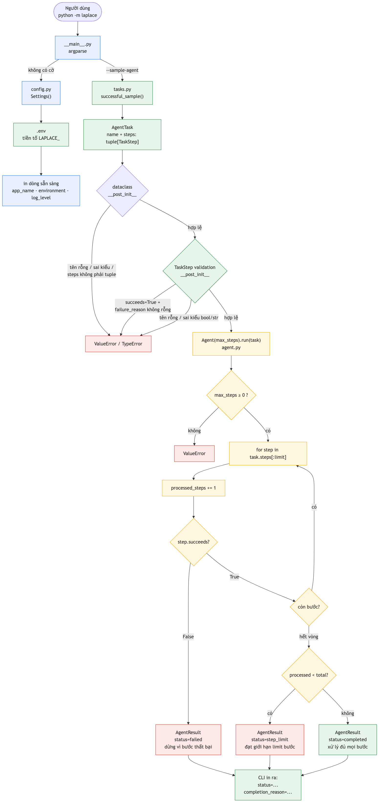
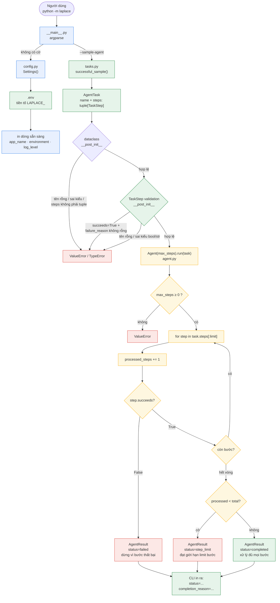

# Sơ đồ nguyên lý hoạt động — Laplace-Demon (bản triển khai, Sprint 2)

> Nguồn: mã thật của `Laplace-Demon/laplace/` — `__main__.py`, `agent.py`, `config.py`, `tasks.py`.
> Sprint 2: **Agent loop thuần Python, deterministic** — không DB, không LLM, không tool, không Telegram, không trace.

## Nguyên lý tóm tắt

1. `__main__.py` là CLI (`python -m laplace`). Không có cờ → khởi tạo `Settings()` và in dòng sẵn sàng. Có `--sample-agent` → chạy nhiệm vụ mẫu.
2. `tasks.py` chỉ chứa **dữ liệu**: factory tạo `AgentTask` (tên + tuple `TaskStep` theo thứ tự). Không thực thi gì. Cả `TaskStep` và `AgentTask` đều validate trong `__post_init__`: tên rỗng → `ValueError`, sai kiểu → `TypeError`, bước thành công kèm `failure_reason` → `ValueError`.
3. `agent.py` chứa vòng lặp: `Agent(max_steps).run(task)` xử lý **tối đa một bước mỗi vòng**, dừng ngay khi bước thất bại (`failed`) hoặc chạm giới hạn (`step_limit`), hết bước → `completed`. Mọi kết quả đều có `completion_reason` khác rỗng. `AgentResult` cũng validate: `processed_steps` không được vượt `total_steps`, `completion_reason` không rỗng.
4. `config.py` nạp `.env` (tiền tố `LAPLACE_`) qua pydantic-settings — chỉ phục vụ đường in dòng sẵn sàng.

## Sơ đồ luồng hoạt động

## Ba trạng thái kết thúc (stop semantics)

| Trạng thái | Khi nào | `completion_reason` |
|---|---|---|
| `completed` | xử lý đủ mọi bước thành công | "Hoàn thành vì tất cả các bước... được xử lý thành công." |
| `failed` | một bước có `succeeds=False` → dừng **ngay lập tức**, các bước sau không bị xử lý | kèm `failure_reason` của bước |
| `step_limit` | `max_steps` < tổng số bước | "Dừng vì đạt giới hạn N bước..." |

Bất biến: mỗi vòng chỉ tính một bước **sau khi đã xử lý**; `max_steps=0` → không xử lý bước nào; `AgentResult` là dataclass bất biến (`frozen=True`) nên caller phân biệt được số bước đã xong mà không cần đọc text.
