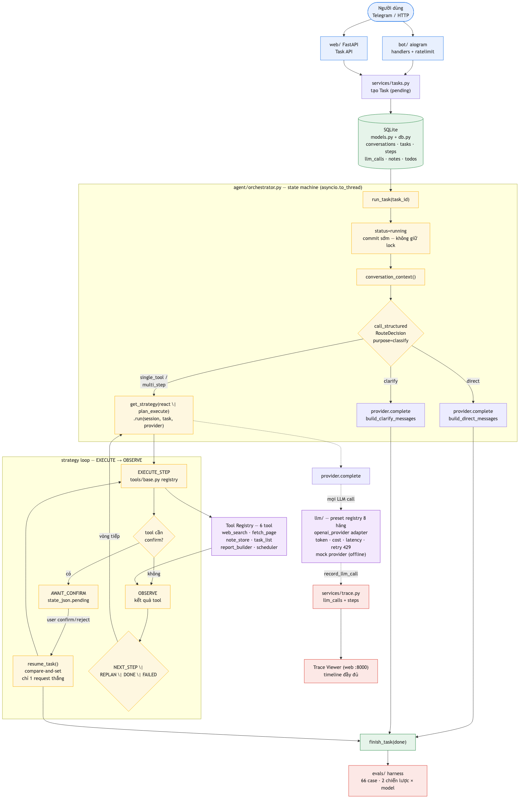
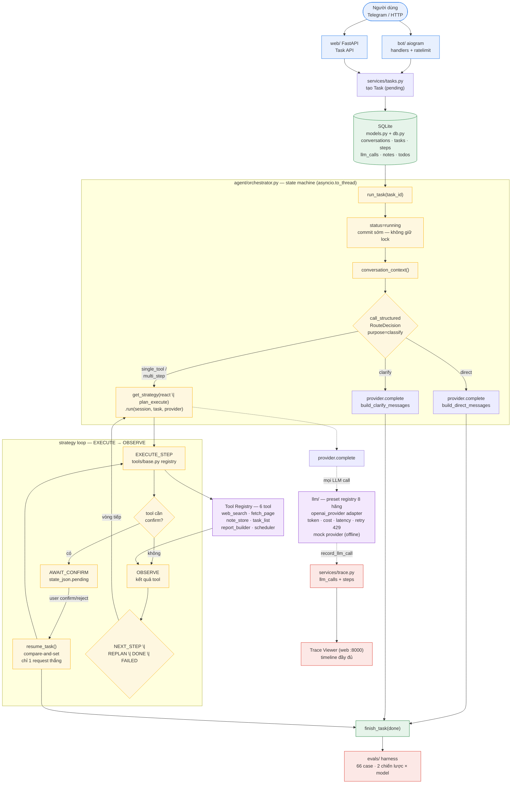

# Sơ đồ nguyên lý hoạt động — bản Beta (Laplace's Demon full-stack)

> Nguồn: mã thật của `beta/laplace/` — `__main__.py`, `agent/orchestrator.py`, `agent/strategies.py`, `llm/`, `tools/`, `services/`, web/bot.
> Beta là hệ thống đầy đủ: Telegram + FastAPI + SQLite + LLM 8 hãng + 6 tool + trace + eval, đối chiếu để thấy tầm nhìn sản phẩm mà bản triển khai đang đi tới từng sprint.

## Nguyên lý tóm tắt

1. `python -m laplace` khởi động **một tiến trình duy nhất**: web FastAPI (API + trace viewer, cổng 8000) + APScheduler; nếu có Telegram token thì bot polling chạy song song trong cùng event loop.
2. Mọi yêu cầu người dùng (Telegram hoặc API) → tạo row `Task` trong SQLite → gọi `orchestrator.run_task(task_id)` qua `asyncio.to_thread` (sync, không giữ write-lock DB lúc gọi LLM).
3. Orchestrator là **state machine**: `pending → running → CLASSIFY` (LLM chọn route: `direct` / `clarify` / `single_tool` / `multi_step`).
   - `direct`/`clarify` → 1 call LLM → `done`.
   - `single_tool`/`multi_step` → strategy loop (`react` | `plan_execute`): `EXECUTE_STEP → OBSERVE → (NEXT_STEP | REPLAN | AWAIT_CONFIRM | DONE | FAILED)`.
4. Tool ghi (`note_store`, `task_list`, `scheduler`) cần confirm → task dừng ở `awaiting_confirm`; người dùng xác nhận → `resume_task()` dùng **compare-and-set** để chỉ một request được "giành" task, tránh double-execution.
5. Mọi call LLM và tool đều ghi trace (`llm_calls` / `steps`) → Trace Viewer web xem được timeline đầy đủ (tokens, cost, latency).

## Sơ đồ luồng hoạt động

## So sánh nhanh Beta ⇄ Laplace-Demon (triển khai)

| Khía cạnh | Laplace-Demon (Sprint 2) | Beta |
|---|---|---|
| Phạm vi | Agent loop thuần Python, 1 module | Full-stack: Telegram, web, DB, scheduler, eval |
| LLM | Không có (deterministic) | 8 hãng + mock, preset registry |
| Tool | Không có | 6 tool, registry, confirm gating |
| Trạng thái dừng | `completed` / `failed` / `step_limit` | `done` / `failed` / `awaiting_confirm` (+ REPLAN) |
| Trace | Không | `llm_calls` + `steps` → Trace Viewer |
| Persistence | Không | SQLite (SQLAlchemy) |
| Human-in-the-loop | Không | `resume_task` compare-and-set |
